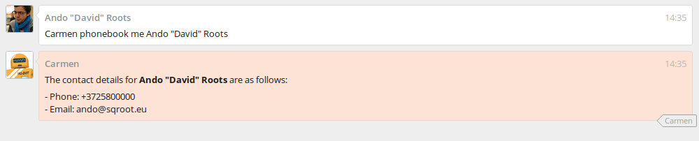

# hubot-simple-phonebook

Query [Hubot](https://github.com/github/hubot) brain for user's contact information

[](https://www.npmjs.com/package/hubot-simple-phonebook)
[](https://github.com/anroots/hubot-simple-phonebook/releases)
[](https://github.com/anroots/hubot-simple-phonebook/blob/master/LICENSE)

This is a simple phonebook script for querying user contact information from the robot brain. You can set this information
manually with the `phonebook set` command, have it auto-populated by your adapter (the [hubot-fleep](https://github.com/anroots/hubot-fleep)
adapter supports this) or import it via a custom script directly into Redis.



## Installation

In your Hubot project directory, run:

```bash
npm install hubot-simple-phonebook --save
```

Enable the script by adding **hubot-simple-phonebook** to your `external-scripts.json`:

```json
[
  "hubot-simple-phonebook"
]
```
## Commands

* _hubot phonebook me <name>_ - Get contact information for <name>
* _hubot phonebook set (email|phone) of <name> to <value>_ - Saves the email or phone of the specified user

## Example Usage

Get contact information for a user called "David":

```
Hubot phonebook me David
```

Save the phone of an user called "Rose Tyler":

```
Hubot phonebook set phone of Rose Tyler to +4413294574
```

## Contributing

Pull requests and issue reports are welcome.

## Licence

The MIT License (MIT). Please see LICENCE file for more information.